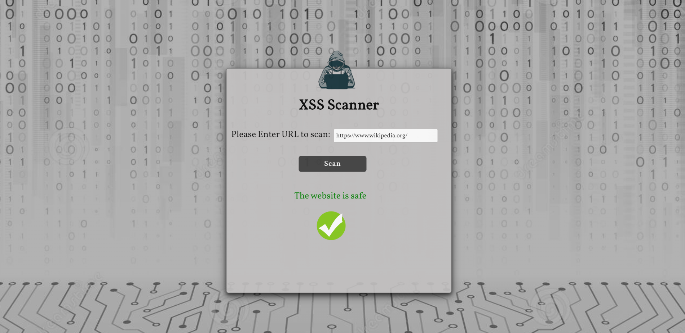

# XSS Scanner

Cross-Site Scripting (XSS) is one of the most well known web application vulnerabilities. It even has a dedicated chapter in the OWASP Top 10 project and it is a highly chased vulnerability in bug bounty programs.

The scanner gets a link from the user and scan the website for XSS vulnerability by injecting malicious scripts at the input place. The injection happens in headless browser named Chromium and controlled by Puppeteer automation.

It works in two steps:
1. Find the target: In this first step, the tool tries to identify all the places at the page including injectable parameters in forms, URLs, headers, etc.
2. Test for XSS: For each place discovered in the previous step, the scanner will try to detect if the parameters are vulnerable to Cross-Site Scripting. The tool injects a piece of JavaScript code, including some special HTML characters (>, <, ", ') and it will try to see if they are returned in the response page without sanitization.
If the tool detects at least one vulnerability, it will return that the website have XSS vulnerability.

### Technologies
 * Puppeteer
 * Javascript
 * NodeJS
 * Express
 
 
 
### How to install

Clone the repository:
```
git clone https://github.com/MariaGarber/XSS-Scanner.git
```
Enter the clonned folder:
```
cd XSS-Scanner
```
Install the Live Server:
```
npm install
```
Run the application:
```
npm start
```
Open the browser at http://localhost:4000/
